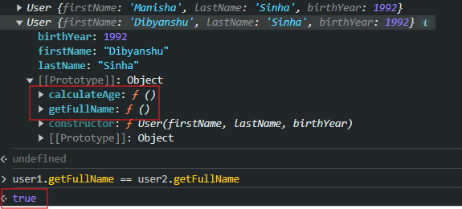

# OOPS in JS

## 4 pillars of OOPS

1. Encapsulation - Binding properties and method in one unit in a central place.

   ```
   const User = {
       firstName: 'Manisha',
       lastName = 'Sinha',
       getFullName () {
           return `${this.firstName} ${this.lastName}`
       }
   }
   ```

2. Abstraction - Not showing the unnecessary properties and methods outside the object

3. Polymorphism
4. Inheritance

### References

1. [Anurag Singh Procodrr playlist](https://www.youtube.com/watch?v=FH_6ww5b52k&list=PLfEr2kn3s-bp5qRVFVRHuntWy2L9i9Arh&index=1)
2. [Procademy playlist](https://www.youtube.com/watch?v=FMIuwvt0vGQ&list=PL1BztTYDF-QOvKYBBYdjzHISCeaYCAEfH)
3. [article](https://dev.to/bchau/factory-functions-vs-constructors-500m#:~:text=A%20constructor%20function%20is%20another,and%20the%20keyword%20%22this%22.)

### Factory Functions

Let's create 2 users.

```
let user1 = {
    firstName: 'Manisha',
    lastName: 'Sinha',
    birthYear: 1992,
    calculateAge() {
        return new Date.getFullYear() - this.birthYear;
    }
    getFullName() {
        return `${this.firstName} ${this.lastName}`;
    }
}

let user2 = {
    firstName: 'Dibyanshu',
    lastName: 'Sinha',
    birthYear: 1992,
    calculateAge() {
        return new Date.getFullYear() - this.birthYear;
    }
    getFullName() {
        return `${this.firstName} ${this.lastName}`;
    }
}
```

By using this method, to create 100 users we would have to create 100 instances that leads to code repetition [This violates DRY principle]. Also, un-necessary memory consumption will happen because for every instances separate methods will be created which is logically doing the same thing.
Well, user1.getFullName() and user2.getFullName() are not the same function in memory. Each object gets its own copy of the function. Meaning, that when the function creates an object and returns it, it copies the properties and values and attaches them to every object calling the function. So to avoid this issue factory function is introduced.

```
function User (firstName, lastName, birthYear) {
    return {
        firstName: firstName,
        lastName: lastName,
        birthYear: birthYear,
        calculateAge () {
            return new Date().getFullYear() - this.birthYear;
        },
        getFullName() {
            return `${this.firstName} ${this.lastName}`;
        }
    }

}
let user1 = User ('Manisha', 'Sinha', 1992);
let user2 = User ('Dibyanshu', 'Sinha', 1992);
```

It resolves the problem of code repetition but still every instances has their own methods which are logically same. And so constructor function comes into the play.

### Function constructors

A constructor function is another javascript pattern, that is very similar to factory functions. Though, unlike factory functions, constructor functions do not actually return an object. To create different objects with the same properties, we would need to use the keyword "new" and the keyword "this".

```
function User (firstName, lastName, birthYear) {
    // const this = {}; - automatically done by js, we don't explicitly have to do it
        this.firstName= firstName,
        this.lastName = lastName,
        this.birthYear = birthYear,
        this.calculateAge = function () {
            return new Date().getFullYear() - this.birthYear;
        },
        this.getFullName = function () {
            return `${this.firstName} ${this.lastName}`;
        }

    // return this; - automatically done by js, we don't explicitly have to do it

}

let user1 = new User ('Manisha', 'Sinha', 1992);
let user2 = new User ('Dibyanshu', 'Sinha', 1992);
```


When we use the term "new" in front of a function call, javascript does two things for us automatically:

1. Inside the function, creates an empty object with the name "this".
2. Returns the object "this" to the statement that called the function initially.

Even with this approach we haven't achieve Inheritance yet, it is still creating separate methods for each instance. And this issue is resolved by using `prototypal Inheritance` where we define the common methods in the prototype of the constructor function.

When a constructor is made, it comes with its own prototype. When we create a new user object using the "new" keyword, it creates an instance of the User type. In other words, user1's prototype is of type "User". Now, user1 is inheriting from the User constructor. This allows us to add properties to the prototype car.

```
function User (firstName, lastName, birthYear) {
        this.firstName= firstName,
        this.lastName = lastName,
        this.birthYear = birthYear
}

User.prototype.calculateAge = function () {
            return new Date().getFullYear() - this.birthYear;
        };
User.prototype.getFullName = function () {
            return `${this.firstName} ${this.lastName}`;
        };
let user1 = new User ('Manisha', 'Sinha', 1992);
let user2 = new User ('Dibyanshu', 'Sinha', 1992);
console.log(user1, user2);
```



[Link - prototypal Inheritance with function constructor](https://www.youtube.com/watch?v=gRILddYACkg&list=PL1BztTYDF-QOvKYBBYdjzHISCeaYCAEfH&index=9)

### Classes [Syntactical sugar of function constructors]

```

```
